# lambda-auth

## Instruções para deploy e configuração da API Gateway

### Deploy

É necessário que as configurações de acesso ao AWS já estejam configuradas.

Instruções de configuração em [AWS Comand Line Interface](https://aws.amazon.com/pt/cli/#:~:text=AWS%20Command%20Line%20Interface%201%20aws-shell%20%28Developer%20Preview%29,easy%20to%20manage%20your%20Amazon%20S3%20objects.%20)

Siga os passos:

1) Acesse a oasta do projeto com a função `src\LambadaAuth`;

2) Execute o comando: `dotnet lambda deploy-function`;

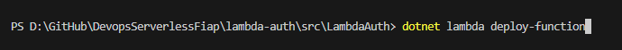

3) Informe o nome da função: `LambdaAuthFiap`

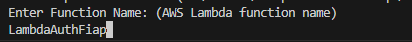

4) Informe o nome IAM Role: `RoleLambdaAuthFiap`

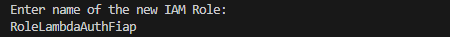

5) Selecione IAM Policy: `4 - AWSLambdaBasicExecutionRole`

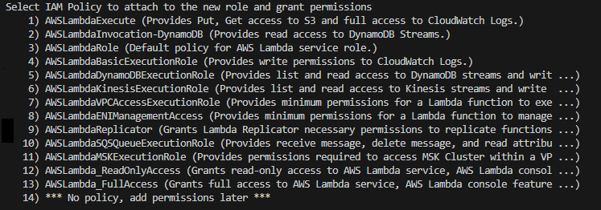

Ao final do processo, a função lambda estará disponível no console da AWS.

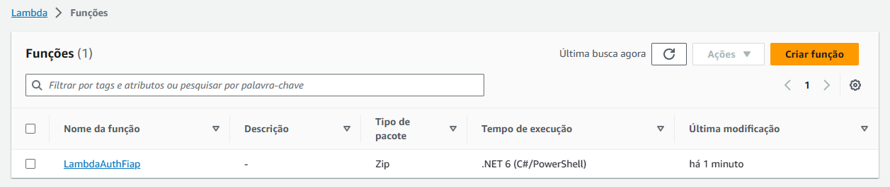

### Configuração do API Gateway

Após a publicação selecione no console a função Lambda criada.

Adicione um gatilho da função lambda.

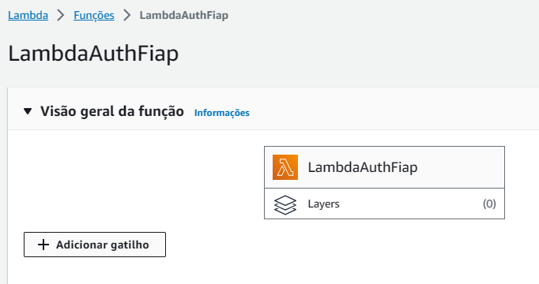

Selecione `API Gateway`.

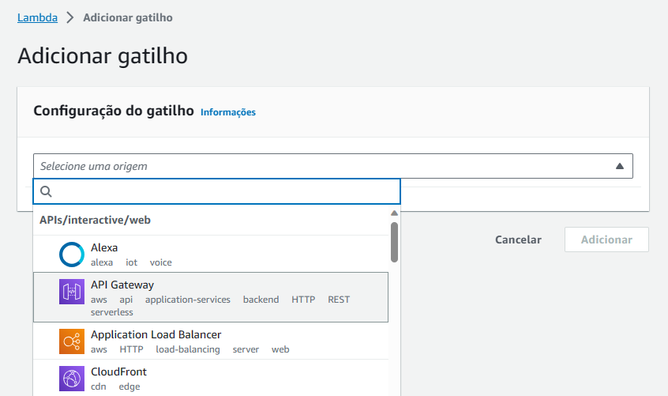

Crie a API Gateway com os seguintes parâmetros:

    - API Type: `REST API`
    - Security: `Open`

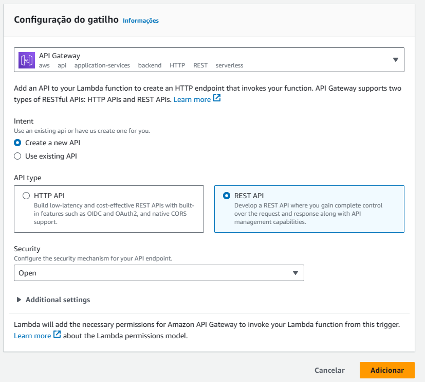

Após a criação, o endpoint de acesso já estará disponível.

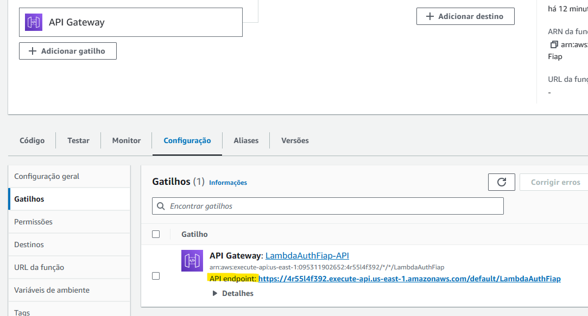

Porém, para que a API aceite os parâmetros configurados, ainda será necessário configurar a forma de Integração da Requisição.

Clique sobre a `Solicitação de Integração`.

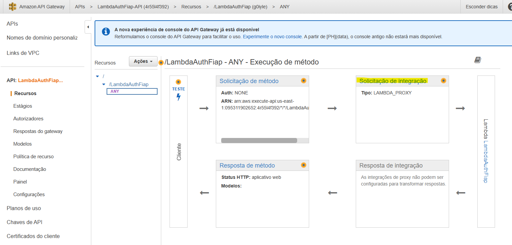

Desmarque a opção `Usar a integração de proxy do Lambda`.

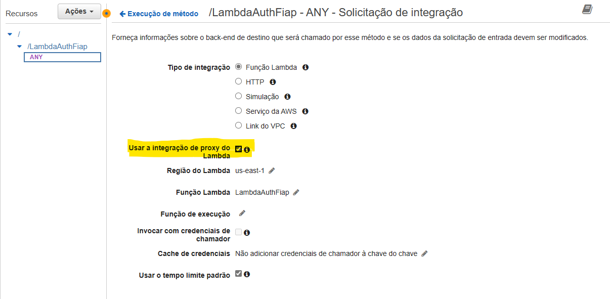

Por fim, clique no botão `Ações` e, na sequência em `Implantar API`.

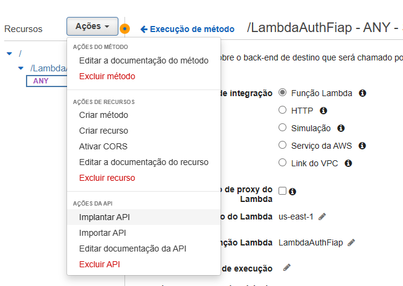

Pronto, o acesso à função Lambda pelo API Gateway já está disponível.

